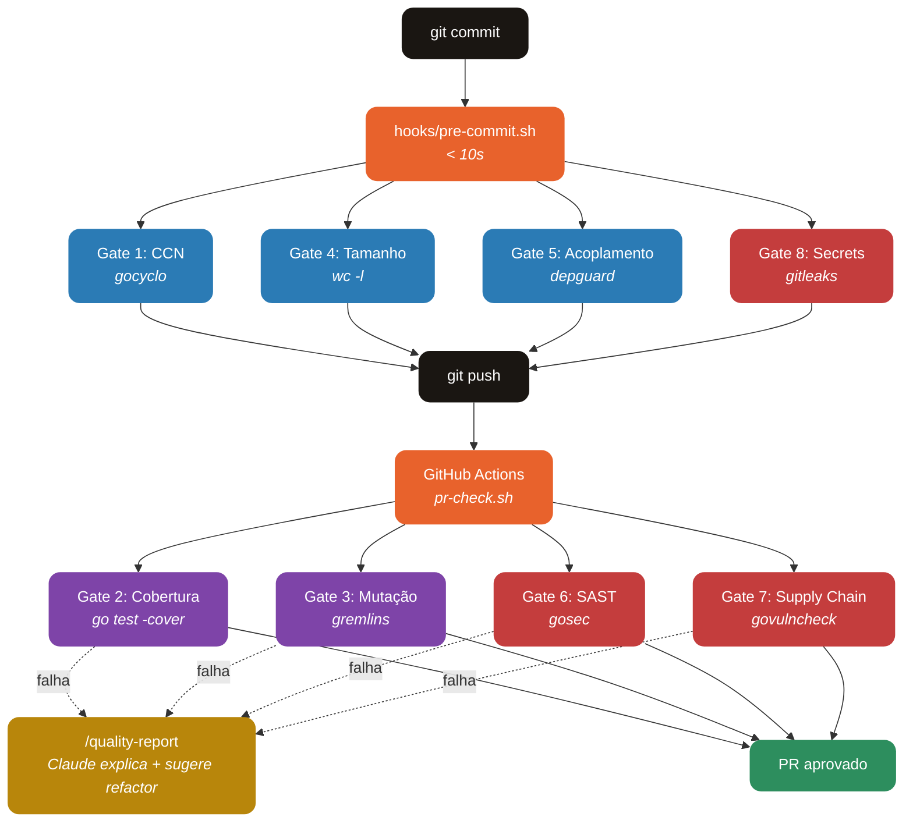

<div align="center">

# PR Quality Gates

**8 gates de qualidade e segurança para validar Pull Requests em projetos Go — complexidade, testes, arquitetura, SAST, supply chain e secrets.**

[](https://go.dev)
[](https://claude.com/claude-code)
[](#)
[](#license)

[Features](#features) · [Como Funciona](#como-funciona) · [Instalação](#instalação) · [Configuração](#configuração) · [Gates](#gates) · [Roadmap](#roadmap)

</div>

---

## O que é o PR Quality Gates?

PR Quality Gates é um plugin do Claude Code que bloqueia commits e PRs quando o código não atende a métricas objetivas de qualidade, arquitetura e segurança. Ele roda localmente via pre-commit para feedback rápido e no CI via GitHub Actions para validação completa.

**Sem LLM no caminho crítico.** Todas as métricas são medidas por ferramentas determinísticas (gocyclo, gremlins, gosec, govulncheck, gitleaks, depguard). O Claude só entra quando você pede o comando `/quality-report` para explicar violações e sugerir refactors.

---

## Features

### 8 Gates ativos

| # | Gate | O que mede | Threshold padrão |
|---|---|---|---|
| 1 | **Complexidade Ciclomática** | CCN máximo por função | ≤ 10 |
| 2 | **Cobertura de Testes** | Coverage global (go test -cover) | ≥ 85% |
| 3 | **Mutação de Testes** | Mutation score (gremlins) | ≥ 65% |
| 4 | **Tamanho de Módulos** | Linhas por arquivo .go | ≤ 300 |
| 5 | **Acoplamento** | Ciclos, camadas invertidas, impl-to-impl | zero violações |
| 6 | **SAST** | Vulnerabilidades estáticas (gosec) | zero HIGH/CRITICAL |
| 7 | **Supply Chain** | CVEs em deps (govulncheck + osv-scanner) | CVSS < 7.0 sem patch |
| 8 | **Secrets** | Tokens/keys hardcoded (gitleaks) | zero leaks |

Adicionalmente:

- **Pre-commit rápido** — gates 1, 4, 5, 8 rodam localmente em segundos
- **PR check completo** — os 8 gates rodam em CI via GitHub Actions
- **Thresholds configuráveis** — `config/thresholds.json` centraliza todos os valores
- **Exemptions por arquivo/regra** — útil para legado em refactor
- **Slash command `/quality-report`** — Claude explica violações e sugere refactors priorizados

---

## Como Funciona



### Dois tempos de execução

O plugin separa gates por velocidade para não atrapalhar o fluxo local:

- **Local (pre-commit):** gates 1, 4, 5, 8 — sub-segundo em projetos médios
- **CI (PR check):** todos os 8 gates — mutação (gate 3) e supply-chain (gate 7) são os mais lentos

---

## Tech Stack

| Camada | Tecnologia |
|---|---|
| **Runtime** | Bash 4+ |
| **Parser JSON** | jq |
| **CCN** | [gocyclo](https://github.com/fzipp/gocyclo) |
| **Coverage** | go test -coverprofile nativo |
| **Mutation** | [gremlins](https://github.com/go-gremlins/gremlins) |
| **Coupling** | [golangci-lint](https://golangci-lint.run) + depguard |
| **SAST** | [gosec](https://github.com/securego/gosec) |
| **Supply Chain** | [govulncheck](https://pkg.go.dev/golang.org/x/vuln) + [osv-scanner](https://github.com/google/osv-scanner) |
| **Secrets** | [gitleaks](https://github.com/gitleaks/gitleaks) |
| **CI** | GitHub Actions |
| **Plugin host** | Claude Code |

---

## Instalação

### Pré-requisitos

- Go 1.22+
- Bash 4+ e jq
- Claude Code com suporte a plugins

### Via Claude Code (recomendado)

```
/plugin marketplace add JohnPitter/pr-quality-gates-marketplace
/plugin install pr-quality-gates@pr-quality-gates
```

### Manual

```bash
git clone https://github.com/JohnPitter/pr-quality-gates.git \
  ~/.claude/plugins/pr-quality-gates

chmod +x ~/.claude/plugins/pr-quality-gates/hooks/*.sh
chmod +x ~/.claude/plugins/pr-quality-gates/gates/*.sh
```

### Ativar o workflow no seu projeto Go

```bash
mkdir -p .github/workflows
cp ~/.claude/plugins/pr-quality-gates/.github/workflows/pr-check.yml \
   .github/workflows/
git add .github/workflows/pr-check.yml
git commit -m "ci: add PR quality gates"
```

---

## Configuração

Todos os thresholds ficam em `config/thresholds.json`:

```json
{
  "ccn_max": 10,
  "coverage_min": 0.85,
  "mutation_min": 0.65,
  "file_lines_max": 300,
  "sast_min_severity": "HIGH",
  "supply_chain_max_cvss": 7.0,
  "scan_paths": ["./..."],
  "exemptions": {
    "file_lines_max": ["internal/legacy/big_file.go"],
    "ccn_max": [],
    "sast_rules": ["G104"],
    "secrets_paths": ["testdata/fixtures/"]
  }
}
```

### Exemptions

Use `exemptions` para código legado que está em refactor progressivo. O arquivo/regra listado é ignorado **apenas** pelo gate correspondente — os outros continuam avaliando normalmente.

### Regras de camada (Gate 5)

Edite `config/depguard.yml` para refletir a arquitetura do seu projeto. O padrão assume `api → service → domain → infra`.

---

## Gates

### Gate 1 — Complexidade Ciclomática

Falha se qualquer função ultrapassar CCN 10. Funções com muita ramificação são difíceis de testar e propensas a bugs.

**Refactor típico:** extrair early returns, substituir if/else encadeado por tabela de dispatch, quebrar função em sub-funções.

### Gate 2 — Cobertura de Testes

Falha se a cobertura global estiver abaixo de 85%. Foca em cobertura de linhas via `go test -coverprofile`.

### Gate 3 — Mutação de Testes

Falha se o mutation score estiver abaixo de 65%. Mede a qualidade dos testes, não a quantidade.

### Gate 4 — Tamanho de Módulos

Falha se qualquer arquivo `.go` (exceto testes) tiver mais de 300 linhas.

### Gate 5 — Acoplamento de Dependências

Falha em três cenários: ciclos de import, camadas invertidas, e impl-to-impl direto sem interface.

### Gate 6 — SAST (Static Application Security Testing)

Roda `gosec` no código Go e detecta padrões inseguros:

- SQL injection (`G201`, `G202`)
- Command injection (`G204`)
- Path traversal (`G304`)
- Crypto fraco: DES, MD5, SHA1, RC4 (`G401-G405`)
- Unsafe TLS (`G402`)
- Hardcoded credentials (`G101`)
- Unsafe deserialization
- Integer overflow (`G115`)

**Threshold:** zero vulnerabilidades `HIGH` ou `CRITICAL` com confidence ≥ medium.

### Gate 7 — Supply Chain Security

Três verificações em camadas:

1. **`govulncheck`** — CVEs conhecidas em deps que seu código **realmente usa** (análise de call graph, baixo falso positivo)
2. **`go mod verify`** — integridade de `go.sum` (detecta adulteração)
3. **`osv-scanner`** (se instalado) — scan cross-ecosystem mais amplo (OSV database)

**Threshold:** zero CVEs ativas com CVSS ≥ 7.0 sem patch disponível.

### Gate 8 — Secrets Detection

Roda `gitleaks` no repo inteiro + mudanças não commitadas. Detecta:

- AWS access keys, secret keys, session tokens
- GitHub tokens (`ghp_`, `gho_`, `ghs_`)
- Slack webhooks e bot tokens
- Private keys (RSA, EC, PGP, SSH)
- JWTs suspeitos
- Connection strings com credenciais embutidas
- Riot API tokens, OpenAI keys, Stripe keys, etc.

**Threshold:** zero leaks. Se falhar, **rotacione o secret imediatamente** — não apenas remova do código.

---

## Uso com Claude Code

Rode a suite completa e peça um relatório priorizado:

```
/quality-report
```

O Claude vai executar todos os gates, resumir cada violação em 1 linha, sugerir refactors concretos, e priorizar por impacto (alto/médio/baixo).

---

## Estrutura

```
pr-quality-gates/
  plugin.json                  # manifesto do plugin Claude Code
  hooks/
    pre-commit.sh              # gates rápidos (local)
    pr-check.sh                # suite completa (CI)
  gates/
    01-ccn.sh                  # complexidade ciclomática
    02-coverage.sh             # cobertura de testes
    03-mutation.sh             # mutação de testes
    04-module-size.sh          # tamanho de módulos
    05-coupling.sh             # acoplamento de dependências
    06-sast.sh                 # SAST (gosec)
    07-supply-chain.sh         # supply chain (govulncheck + osv-scanner)
    08-secrets.sh              # secrets detection (gitleaks)
  config/
    thresholds.json            # thresholds centralizados
    depguard.yml               # regras de camadas
  commands/
    quality-report.md          # slash command /quality-report
  .github/workflows/
    pr-check.yml               # GitHub Actions
```

---

## Roadmap

Gates planejados para atingir nível de maturidade de big techs. Priorizados por ROI.

### v0.3.0 — Governance & Performance

| Gate | Descrição | Ferramenta |
|---|---|---|
| **9. License Compliance** | Whitelist de licenças (MIT, Apache-2.0, BSD, ISC). Bloqueia GPL/AGPL. | `go-licenses` |
| **10. Performance Regression** | Compara benchmarks HEAD vs main. Falha se piorar >10% em tempo ou alocações. | `benchstat` |
| **11. API Breaking Changes** | Detecta mudanças incompatíveis em pacotes exportados. Força bump de major. | `apidiff` |

### v0.4.0 — Deep Quality Signals

| Gate | Descrição | Ferramenta |
|---|---|---|
| **12. Cognitive Complexity** | Métrica SonarQube — mais fiel ao código real que CCN. | `gocognit` |
| **13. Test Quality** | Detecta testes flaky, asserções fracas, suites lentas, ratio assertions/test baixo. | custom |
| **14. Observability Enforcement** | Toda função pública com I/O precisa ter log estruturado ou span OTel. Erros com context wrap. | custom AST analyzer |
| **15. Documentation Coverage** | `godoc` coverage ≥ 80% em símbolos exportados. CHANGELOG.md atualizado no PR. | `revive` |

### v0.5.0 — Architecture & Review Automation

| Gate | Descrição | Ferramenta |
|---|---|---|
| **16. Architecture Fitness Functions** | Testes executáveis estilo ArchUnit: "nenhum handler chama DB direto", "todo service tem interface". | custom (go/ast) |
| **17. Code Ownership Enforcement** | `CODEOWNERS` automático. Mínimo 2 approvers em arquivos críticos. Dismissal de stale reviews. | GitHub API |
| **18. Change Risk Scoring** | Score = LOC × criticidade × histórico de bugs. Alto risco → review sênior + QA manual. | custom ML/heuristic |

### Infraestrutura pós-v0.5

O que separa big tech do resto não é só ter os gates — é **como** eles rodam:

- **Diff-aware execution** — só roda gates nos pacotes alterados. Corta 10min → 30s em repos grandes.
- **Paralelização total** — todos os 18 gates em paralelo no CI, não sequencial.
- **Incremental baseline** — aceita estado atual como baseline, só falha em regressões (essencial para adoção em legado).
- **Override governado** — skip com justificativa escrita em audit log, nunca `--no-verify` silencioso.
- **Dashboard histórico** — trend charts de CCN, coverage, mutation score por semana.
- **PR inline comments** — comentários no diff da PR (estilo SonarCloud), não só logs de CI.
- **Autofix bot** — formatting, imports, simples refactors commitados automaticamente pelo bot.

---

## License

MIT License — use livremente.
