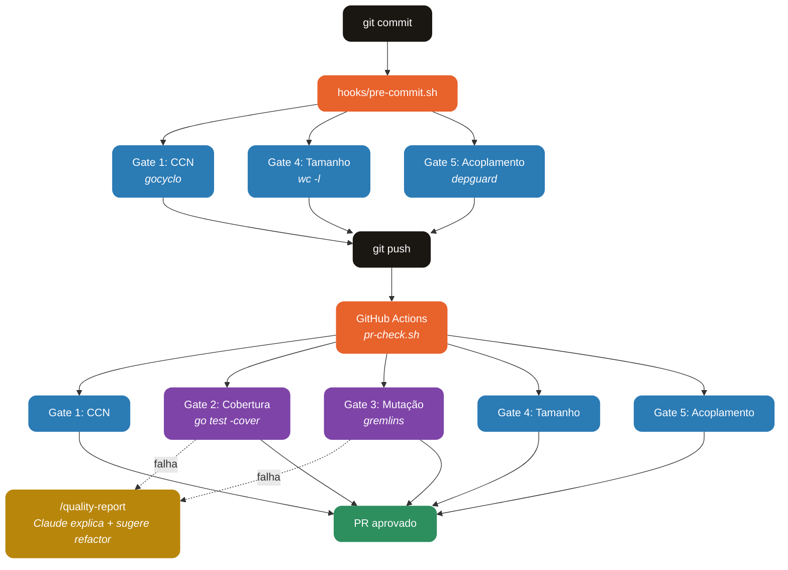

<div align="center">

# PR Quality Gates

**5 gates de qualidade para validar Pull Requests em projetos Go — CCN, cobertura, mutação, tamanho e acoplamento.**

[](https://go.dev)
[](https://claude.com/claude-code)
[](#license)

[Features](#features) · [Como Funciona](#como-funciona) · [Instalação](#instalação) · [Configuração](#configuração) · [Gates](#gates)

</div>

---

## O que é o PR Quality Gates?

PR Quality Gates é um plugin do Claude Code que bloqueia commits e PRs quando o código não atende a cinco métricas objetivas de qualidade. Ele roda localmente via pre-commit para feedback rápido e no CI via GitHub Actions para validação completa.

**Sem LLM no caminho crítico.** Todas as métricas são medidas por ferramentas determinísticas (gocyclo, go test -cover, gremlins, depguard). O Claude só entra quando você pede o comando `/quality-report` para explicar violações e sugerir refactors.

---

## Features

| Gate | O que mede | Threshold padrão |
|---|---|---|
| **Complexidade Ciclomática** | CCN máximo por função | ≤ 10 |
| **Cobertura de Testes** | Coverage global (go test -cover) | ≥ 85% |
| **Mutação de Testes** | Mutation score (gremlins) | ≥ 65% |
| **Tamanho de Módulos** | Linhas por arquivo .go | ≤ 300 |
| **Acoplamento** | Ciclos, camadas invertidas, impl-to-impl | zero violações |

Adicionalmente:

- **Pre-commit rápido** — gates 1, 4 e 5 rodam localmente em segundos antes do commit
- **PR check completo** — os 5 gates rodam em CI via GitHub Actions
- **Thresholds configuráveis** — `config/thresholds.json` centraliza todos os valores
- **Exemptions por arquivo** — útil para legado em refactor
- **Slash command `/quality-report`** — Claude explica violações e sugere refactors priorizados

---

## Como Funciona



### Dois tempos de execução

O plugin separa gates por velocidade para não atrapalhar o fluxo local:

- **Local (pre-commit):** gates 1, 4 e 5 — todos sub-segundo em projetos médios
- **CI (PR check):** todos os 5 gates — mutação (gate 3) é o mais lento e roda só aqui

---

## Tech Stack

| Camada | Tecnologia |
|---|---|
| **Runtime** | Bash 4+ |
| **Parser JSON** | jq |
| **CCN** | [gocyclo](https://github.com/fzipp/gocyclo) |
| **Coverage** | go test -coverprofile nativo |
| **Mutation** | [gremlins](https://github.com/go-gremlins/gremlins) |
| **Coupling** | [golangci-lint](https://golangci-lint.run) + depguard |
| **CI** | GitHub Actions |
| **Plugin host** | Claude Code |

---

## Instalação

### Pré-requisitos

- Go 1.22+
- Bash 4+ e jq
- Claude Code com suporte a plugins

### Via Claude Code

```bash
/plugin install https://github.com/JohnPitter/pr-quality-gates
```

### Manual

```bash
# Clone para o diretório de plugins do Claude Code
git clone https://github.com/JohnPitter/pr-quality-gates.git \
  ~/.claude/plugins/pr-quality-gates

# Dê permissão de execução aos scripts
chmod +x ~/.claude/plugins/pr-quality-gates/hooks/*.sh
chmod +x ~/.claude/plugins/pr-quality-gates/gates/*.sh
```

### Ativar o workflow no seu projeto Go

```bash
# Copie o workflow para seu repositório
mkdir -p .github/workflows
cp ~/.claude/plugins/pr-quality-gates/.github/workflows/pr-check.yml \
   .github/workflows/
git add .github/workflows/pr-check.yml
git commit -m "ci: add PR quality gates"
```

---

## Configuração

Todos os thresholds ficam em `config/thresholds.json`:

```json
{
  "ccn_max": 10,
  "coverage_min": 0.85,
  "mutation_min": 0.65,
  "file_lines_max": 300,
  "scan_paths": ["./..."],
  "exemptions": {
    "file_lines_max": ["internal/valorant/interceptor.go"],
    "ccn_max": []
  }
}
```

### Exemptions

Use `exemptions` para código legado que está em refactor progressivo. O arquivo listado é ignorado **apenas** pelo gate correspondente — os outros 4 continuam avaliando normalmente.

### Regras de camada (Gate 5)

Edite `config/depguard.yml` para refletir a arquitetura do seu projeto. O padrão assume `api → service → domain → infra` (da camada mais alta para a mais baixa). Ajuste os paths conforme sua convenção.

---

## Gates

### Gate 1 — Complexidade Ciclomática

Falha se qualquer função ultrapassar CCN 10. Funções com muita ramificação são difíceis de testar e propensas a bugs.

**Refactor típico:** extrair early returns, substituir if/else encadeado por tabela de dispatch, quebrar função em sub-funções.

### Gate 2 — Cobertura de Testes

Falha se a cobertura global estiver abaixo de 85%. Foca em cobertura de linhas via `go test -coverprofile`.

**Refactor típico:** adicionar testes para branches não cobertos, remover código morto, mover lógica não testável para pacotes puros.

### Gate 3 — Mutação de Testes

Falha se o mutation score estiver abaixo de 65%. Mede a qualidade dos testes, não a quantidade — um teste que sempre passa mesmo com o código mutado é um teste fraco.

**Refactor típico:** fortalecer asserções, remover testes redundantes, adicionar casos de borda.

### Gate 4 — Tamanho de Módulos

Falha se qualquer arquivo `.go` (exceto testes) tiver mais de 300 linhas. Arquivos grandes indicam responsabilidades misturadas.

**Refactor típico:** extrair sub-pacote, separar tipos em arquivos próprios, dividir god-objects por domínio.

### Gate 5 — Acoplamento de Dependências

Falha em três cenários:

1. **Ciclos de import** — detectados pelo próprio `go build`
2. **Camadas invertidas** — ex: `domain` importando `infra`
3. **Impl-to-impl** — pacotes `.../impl/...` chamando outros pacotes `.../impl/...` direto, sem passar por interface

---

## Uso com Claude Code

Rode a suite completa e peça um relatório priorizado:

```
/quality-report
```

O Claude vai executar todos os gates, resumir cada violação em 1 linha, sugerir refactors concretos, e priorizar por impacto (alto/médio/baixo) baseado no tamanho do arquivo, criticidade da camada e risco de regressão.

---

## Estrutura

```
pr-quality-gates/
  plugin.json                  # manifesto do plugin Claude Code
  hooks/
    pre-commit.sh              # gates rápidos (local)
    pr-check.sh                # suite completa (CI)
  gates/
    01-ccn.sh                  # complexidade ciclomática
    02-coverage.sh             # cobertura de testes
    03-mutation.sh             # mutação de testes
    04-module-size.sh          # tamanho de módulos
    05-coupling.sh             # acoplamento de dependências
  config/
    thresholds.json            # thresholds centralizados
    depguard.yml               # regras de camadas
  commands/
    quality-report.md          # slash command /quality-report
  .github/workflows/
    pr-check.yml               # GitHub Actions
```

---

## License

MIT License — use livremente.
