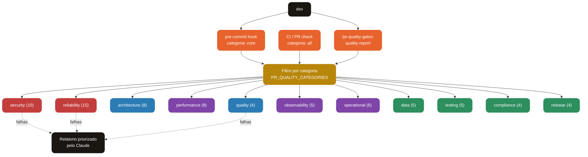

<div align="center">

# PR Quality Gates

**67 gates de qualidade, segurança, arquitetura, performance e confiabilidade para projetos Go — organizados em 11 categorias com filtro seletivo.**

[](https://go.dev)
[](https://claude.com/claude-code)
[](#)
[](#license)

[Features](#features) · [Categorias](#categorias) · [Como Funciona](#como-funciona) · [Instalação](#instalação) · [Uso](#uso) · [Roadmap](#roadmap)

</div>

---

## O que é o PR Quality Gates?

Plugin do Claude Code que roda **67 gates determinísticos** contra um projeto Go, organizados em **11 categorias**. Você escolhe quais categorias rodar — desde `core` (23 gates críticos, ~3-8k tokens) até `all` (67 gates, ~10-30k tokens).

**Sem LLM no caminho crítico:** as métricas são medidas por ferramentas reais (gosec, govulncheck, gitleaks, gocyclo, gremlins, errcheck, contextcheck, errorlint, bodyclose, fieldalignment, etc). O Claude só entra pra explicar violações e sugerir refactors.

**Baseline-aware:** em projetos legados, congele o estado atual e deixe o plugin falhar só em violações novas.

---

## Aviso de custo de token

O plugin roda ferramentas localmente (custo zero), mas a saída é consumida pelo Claude no `/quality-report` e similares. Planeje:

| Comando | Gates rodados | Tokens aproximados |
|---|---|---|
| `/pr-quality-gates:quality-report` | 23 (core) | **3-8k** |
| `/pr-quality-gates:category-report <nome>` | 4-15 (1 categoria) | **1-5k** |
| `/pr-quality-gates:full-audit` | 67 (todos) | **10-30k** |

**Recomendação:** use `quality-report` no dia-a-dia, `category-report` para drill-down, e `full-audit` só quando for realmente necessário (audit trimestral, planejamento de refactor).

---

## Categorias

O plugin é organizado em 11 categorias temáticas. Cada gate pertence a exatamente uma categoria.

| # | Categoria | Gates | O que cobre |
|---|---|---|---|
| 1 | **security** | 10 | SAST, supply chain, secrets, deps saudáveis, pinning, SBOM, rate limit, body size, server timeouts, CORS |
| 2 | **quality** | 4 | CCN, coverage, mutation, module size |
| 3 | **architecture** | 8 | Coupling (layers/impl), project layout, ISP, DI, error taxonomy, god struct, cohesion, change coupling |
| 4 | **performance** | 8 | Benchmark regression, escape analysis, struct layout, I/O buffering, GOMAXPROCS, N+1, allocs in loop, sync.Pool |
| 5 | **reliability** | 15 | Error wrap, ctx propagation, panic, timeouts, race, copylocks, errcheck, defer Close, ticker Stop, goroutine leak, cache TTL, unbounded growth, concurrent map, nil check, bodyclose |
| 6 | **observability** | 5 | PII in logs, log levels, structured logging, metric cardinality, trace propagation |
| 7 | **operational** | 6 | Health endpoints, graceful shutdown, retry idempotency, circuit breaker, feature flags, startup check |
| 8 | **data** | 5 | Transactions, migration rollback, SQL injection, foreign keys, schema compat |
| 9 | **testing** | 5 | Negative paths, fuzz required, timeout tests, goroutine leak tests, property tests |
| 10 | **compliance** | 4 | Data retention, audit trail, right-to-forget, consent tracking |
| 11 | **release** | 4 | CHANGELOG, semver, release signing, reproducible build |

### Presets

- **`core`** = security + reliability + quality (23 gates) — **default em pre-commit**
- **`all`** = todas as 11 categorias (67 gates) — **default em CI**
- Qualquer combinação via `PR_QUALITY_CATEGORIES=security,reliability,performance`

### Cobertura das regras

Cada gate tem cobertura marcada no header:
- **`FULL`** — usa ferramenta OSS consagrada (gosec, gremlins, etc). Baixo falso positivo.
- **`HEURISTIC`** — grep/regex baseado. Pode ter falso positivo/negativo, útil como sinal inicial. Vários emitem `[INFO]` em vez de `[FAIL]`.

Dos 67 gates: ~35 são `FULL` (usam ferramenta especializada), ~32 são `HEURISTIC` (grep-based, melhores que nada e melhorar em v0.4+).

---

## Como Funciona



---

## Instalação

```
/plugin marketplace add JohnPitter/pr-quality-gates-marketplace
/plugin install pr-quality-gates@pr-quality-gates
```

Ferramentas auxiliares são instaladas automaticamente na primeira execução via `go install` (cobrir ~30 tools: gosec, govulncheck, gitleaks, gocyclo, gremlins, errcheck, errorlint, contextcheck, bodyclose, fieldalignment, ineffassign, apidiff, cyclonedx-gomod, nilaway, benchstat).

---

## Uso

### Dia-a-dia: categoria `core`

```
/pr-quality-gates:quality-report
```

Roda 23 gates (security + reliability + quality). Rápido, alto sinal, ~3-8k tokens.

### Drill-down por categoria

```
/pr-quality-gates:category-report reliability
/pr-quality-gates:category-report performance
/pr-quality-gates:category-report architecture
```

### Audit completo

```
/pr-quality-gates:full-audit
```

Todos os 67 gates. ~10-30k tokens — **usar com moderação**.

### Baseline (legacy adoption)

```
/pr-quality-gates:baseline-freeze
```

Congela violações atuais de CCN e module-size. Dali em diante, só novas falham.

### Configuração

`config/thresholds.json` — thresholds de cada gate (ccn_max, coverage_min, file_lines_max, escapes_max, etc)

`config/categories.json` — default preset

`config/depguard.yml` — regras de arquitetura (camadas)

---

## Variáveis de ambiente

| Var | Efeito |
|---|---|
| `PR_QUALITY_CATEGORIES=all\|core\|<list>` | Quais categorias rodar |
| `PR_QUALITY_BASELINE=1` | Modo captura (freeze estado atual) |
| `PR_QUALITY_FULL=1` | Ignora baseline (audit de tudo) |
| `BASE_REF=origin/main` | Ref para comparações (CHANGELOG, benchmark) |

---

## Estrutura

```
pr-quality-gates/
  .claude-plugin/plugin.json
  lib/
    common.sh                  # bootstrap + helpers
    baseline.sh                # ratchet mode
    categories.sh              # filtro + runner
  hooks/
    pre-commit.sh              # roda categoria "core"
    pr-check.sh                # roda "all" (CI)
  gates/
    security/      (10 gates)
    quality/       (4 gates)
    architecture/  (8 gates)
    performance/   (8 gates)
    reliability/   (15 gates)
    observability/ (5 gates)
    operational/   (6 gates)
    data/          (5 gates)
    testing/       (5 gates)
    compliance/    (4 gates)
    release/       (4 gates)
  config/
    thresholds.json
    categories.json
    depguard.yml
  commands/
    quality-report.md          # core
    full-audit.md              # todos (token-heavy)
    category-report.md         # 1 categoria
    baseline-freeze.md         # freeze
```

---

## Roadmap

### v0.4 — upgrade de heurísticas para full

Substituir gates `HEURISTIC` por analisadores Go AST nativos:
- goroutine-leak, concurrent-map, cache-ttl, defer-close → pacote Go dedicado
- Interface discipline, god struct → usa `go/types`
- DI discipline → ast scanner

### v0.5 — infra de escala

- **Diff-aware execution:** rodar só nas categorias afetadas pelo diff
- **Paralelização:** 67 gates em paralelo no CI (~4x mais rápido)
- **Dashboard histórico:** trend de cada categoria em JSON versionado

### v0.6 — advisory tiers

- **BLOCKER / WARNING / INFO** severity levels configuráveis
- **Override governado:** skip com justificativa obrigatória em audit log
- **PR inline comments** no GitHub (estilo SonarCloud bot)

### v0.7 — portabilidade

- Suporte a **Python, TypeScript, Rust** (via plugins filhos)
- Marketplace ecosystem: `pr-quality-gates-python`, `pr-quality-gates-rust`

---

## License

MIT License — use livremente.
